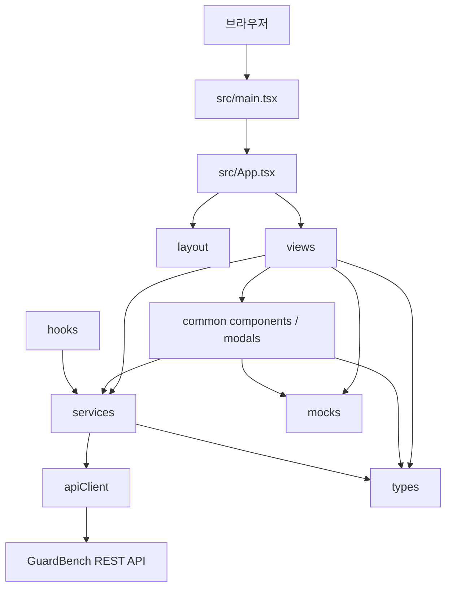

# 프론트엔드 아키텍처

> Status: AS-IS / TO-BE / 미결정
> Owner: Frontend
> Last reviewed: 2026-08-30
> Scope: GitHub Issue #15
> AS-IS baseline: `main@4cf1475a934a28f5eacbb919c7caf08e3d6d6b36`
> Canonical product scope: `guardbench-backend/docs/product/mvp-scope.md` (`APPROVED`)
> Canonical API: `guardbench-backend/docs/api/openapi.yaml` (`APPROVED`)

이 문서는 현재 GuardBench 프론트엔드의 구조와 책임을 기록하고, 승인된 제품·API 계약을 소비하기 위해 필요한 목표 경계와 별도 결정이 필요한 기술 선택을 구분한다. 현재 구조를 목표 아키텍처로 승인하지 않으며 특정 library 도입을 확정하지 않는다.

## 1. 구조 개요



### AS-IS

- `main.tsx`가 React `StrictMode` 아래 `App`을 root에 렌더링한다.
- `App`은 공통 shell, 화면 선택, 선택 Run ID, 모바일 menu와 toast 상태를 소유한다.
- `components/views`와 일부 modal이 API 호출, DTO 변환, loading/error와 사용자 표현을 함께 담당한다.
- `services`는 endpoint별 함수를 제공하지만 DTO 일부가 `types`의 화면 모델에 의존한다.
- `mocks`는 초기 화면 데이터이면서 API 오류 fallback 역할도 한다.
- dependency injection, router, 전역 상태, error boundary와 server-state 계층은 없다.

### TO-BE 경계

- 의존 방향은 화면 → hook/service/mapper → 공통 client → OpenAPI로 흐른다.
- API DTO는 화면 component의 표시 요구와 분리하고 경계에서 명시적으로 mapping한다.
- mock은 실제 API 실패를 숨기는 암묵적 fallback이 아니라 명시적 adapter 또는 fixture로 분리한다.
- 화면이 API lifecycle을 표현하더라도 HTTP envelope parsing과 transport 오류 해석은 공통 client가 담당한다.

구체적인 library와 폴더 재구성은 `미결정`이다.

## 2. 실행과 환경 경계

### AS-IS

- Vite가 개발·build·preview를 담당하고 TypeScript는 `tsc -b`로 build 전에 검사한다.
- API base URL은 `VITE_API_BASE_URL` 또는 `/api/v1`이다.
- Vite proxy 설정은 없으므로 `/api/v1`의 개발 연결 방식은 실행 환경에 의존한다.
- build-time 환경 변수와 브라우저 runtime 설정을 분리하는 계층은 없다.

### TO-BE

- 브라우저에는 비밀 값을 포함하지 않는다.
- API base URL, mock mode 등 공개 설정은 환경별 출처와 기본값을 명시하고 잘못된 실제 배포 설정을 조용히 mock으로 대체하지 않는다.
- 환경별 mock 정책과 배포 설정은 [API 연동 계약](../contracts/api-integration.md) 및 별도 Decision이 소유한다.

## 3. 화면 라우팅과 navigation

### AS-IS

- router 없이 `App.currentView` 값으로 6개 화면을 조건부 렌더링한다.
- `selectedRunId`도 `App` 메모리에 있으며 기본값은 mock `#5001`이다.
- 화면 이동은 callback prop으로 전달되고 URL은 바뀌지 않는다.
- 뒤로 가기, 직접 링크, 새로고침 후 화면·Run 복원이 불가능하다.
- sidebar, dashboard, 실행 이력과 생성 성공 callback이 동일한 로컬 전환 함수를 공유한다.

### TO-BE 책임

- TestRun 상세 진입에는 서버 Run ID를 잃지 않는 navigation 상태가 필요하다.
- navigation state와 화면 내부 modal/form state를 분리한다.
- 직접 링크와 새로고침 복원을 도입한다면 URL이 화면 및 식별자의 canonical source가 되어야 한다.
- 존재하지 않는 ID, 잘못된 URL과 정상 빈 결과를 구분한다.

router 도입 여부, URL 구조, query에 pagination/filter를 보존할지는 `미결정`이다.

## 4. 상태 소유권

| 상태 종류 | AS-IS 소유자 | 목표 경계 |
| --- | --- | --- |
| 현재 화면·선택 Run | `App` | navigation 상태로 명시 |
| 모바일 menu·toast | `App` | 공통 shell UI 상태 |
| Suite/Run 목록 | 각 view | items와 page/filter를 하나의 서버 상태로 관리 |
| TestCase 목록·form | `SuiteDetailModal` | 서버 collection과 form draft 분리 |
| TestRun 결과 | `ResultDetailView` | detail, result page, 선택 Snapshot 분리 |
| Polling | 미사용 `useLiveRunProgress` | Run ID별 lifecycle과 취소 책임 |
| mock 데이터 | view 초기값/fallback | 명시적 환경 adapter 또는 test fixture |

### 서버 상태 (`TO-BE`)

- idle, loading, success, empty, error, stale 상태를 구분한다.
- server collection은 `items`와 pagination/filter metadata를 함께 보존한다.
- request 식별자 또는 취소를 사용해 늦게 도착한 이전 응답이 새 화면 상태를 덮지 않게 한다.
- 이전 성공 데이터를 유지하면 갱신 실패·stale 상태를 함께 표시한다.
- derived UI 값은 원본 DTO를 변경하지 않고 계산한다.

### 로컬 UI 상태

- modal 열림, 선택 행, form draft, 검색 입력과 mobile menu는 서버 진실로 취급하지 않는다.
- mutation 성공 전 로컬 상태를 확정할 경우 rollback 또는 재조회 책임을 명시한다.
- 화면 이탈 시 form 보존 여부와 toast queue 정책은 UI 가이드의 Decision으로 남긴다.

## 5. API 계층과 타입

### AS-IS

```text
view/modal → endpoint service → apiClient → fetch
```

- `apiClient`가 base URL, 공통 header와 success envelope unwrap을 담당한다.
- service가 endpoint와 query/body를 구성한다.
- 일부 service DTO가 화면 `types`를 직접 사용하거나 `any`를 반환한다.
- view가 API→UI 변환과 loading/empty/error/stale 상태를 직접 소유하고 공통 오류 banner를 사용한다.
- API 화면은 조회 실패를 mock으로 대체하지 않는다. Architecture 화면의 정적 자료는 명시적인 데모 자료다.
- `204`, error code와 validation detail 처리 제약은 API 연동 계약에 기록돼 있다.

### TO-BE

```text
view → query/mutation hook 또는 application function
     → service + DTO mapper
     → apiClient
     → OpenAPI
```

- 공통 client: transport, envelope, 204, structured error, abort 경계
- service: endpoint, header, query와 request/response DTO
- mapper: DTO를 UI model로 변환하고 API에 없는 값을 생성하지 않음
- hook/application function: request lifecycle, Polling, race와 cache/refresh 조율
- view: 사용자 행동과 loading/empty/error/success 표현

수동 DTO 유지 또는 OpenAPI 생성 타입 도입, mapper의 정확한 폴더 위치는 `미결정`이다.

## 6. 컴포넌트 책임

### AS-IS

- `App`: shell과 navigation, toast orchestration
- `layout`: sidebar/topbar 표시와 모바일 menu 동작
- `views`: 화면 표시와 API 요청, mapping, filter, 오류 fallback
- `common`: 표시 component와 modal. `SuiteDetailModal`은 API mutation과 form도 소유
- `hooks`: Polling hook 하나가 있으나 화면에서 사용하지 않음

### 목표 경계

- view는 화면 단위 composition과 사용자 상태 표현을 소유한다.
- 공통 표시 component는 API endpoint와 mock을 직접 알지 않는다.
- data-aware modal은 자체 request lifecycle과 외부 갱신 계약을 명시한다.
- toast는 성공·오류·데모를 같은 의미로 표현하지 않도록 message source와 severity를 구분한다.
- hook은 timer cleanup뿐 아니라 in-flight request 취소와 Run 변경 race를 책임진다.

prop drilling, context 또는 전역 store 선택은 실제 공유 범위와 테스트 필요가 확인된 뒤 결정한다.

## 7. Polling 구조

### AS-IS

- `useLiveRunProgress`가 service를 반복 호출하지만 어떤 화면에도 연결되지 않는다.
- hook 내부에 timer, loading, polling과 callback ref가 함께 있다.
- 계약과 다른 상태·progress 타입을 사용한다.

### TO-BE

1. Run ID가 바뀌면 이전 timer와 요청을 취소한다.
2. 상세를 즉시 조회하고 진행 상태이면 다음 조회를 예약한다.
3. `FINISHED`에서 종료하고 outcome/Gate 및 결과 조회로 이어진다.
4. 일시 오류와 terminal API 오류를 구분한다.
5. 화면은 hook 결과를 progress 표시와 재시도 UI로 변환한다.

간격, backoff, background tab과 최대 지속 시간은 API 연동 계약의 `미결정` 사항이다.

## 8. 오류 경계

| 경계 | 책임 |
| --- | --- |
| API client | network/abort/parsing/HTTP와 envelope 오류 구조화 |
| service/mapper | endpoint code와 DTO 변환 오류에 context 부여 |
| hook/application | 재시도, race, mutation 결과 불명과 상태 동기화 |
| view | 사용자에게 loading/empty/error/retry를 표현 |
| React error boundary | 예기치 않은 rendering 오류 격리와 복구 진입점 |

API 오류를 React error boundary에 맡기거나 rendering 오류를 toast만으로 숨기지 않는다. 현재 전역 error boundary는 없다. logging, 관측 도구, 오류 report와 사용자 메시지 정책은 `미결정`이다.

## 9. 폴더와 의존 규칙

### 현재 구조

```text
src/
├─ components/
│  ├─ layout/
│  ├─ views/
│  └─ common/
├─ hooks/
├─ services/
├─ mocks/
├─ types/
├─ App.tsx
└─ main.tsx
```

### 목표 규칙

- `services`와 공통 client는 React component를 import하지 않는다.
- mock은 production service에 암묵적으로 포함되지 않는다.
- 공통 component는 특정 view 또는 endpoint를 import하지 않는다.
- 화면 전용 model과 API DTO의 소유 위치를 구분한다.
- 순환 import를 허용하지 않으며 하위 transport 계층이 상위 UI 계층을 참조하지 않는다.
- 폴더 이동은 독립 구현 이슈에서 수행하고 문서만으로 대규모 재구성을 승인하지 않는다.

## 10. 테스트 전략

### AS-IS

- package script에는 `build`와 `lint`만 있고 unit/component/E2E test script가 없다.
- Playwright dependency와 root `test_playwright.cjs`가 있지만 표준 test script 및 CI 계약은 확인되지 않는다.
- 자동화된 regression·contract test 기반은 없다.

### 목표 테스트 경계

| 수준 | 검증 대상 |
| --- | --- |
| Unit | DTO mapper, status/outcome/Gate 해석, query와 error mapping |
| Component | form validation, loading/empty/error, modal과 사용자 행동 |
| Integration | 화면-service 연결, mutation 동기화, Polling 종료·취소·race |
| Contract | fixture와 승인된 OpenAPI schema drift |
| E2E | Suite 관리 → Run 접수 → 진행 → 결과 분석 핵심 여정 |

test framework, browser 도구, 실제 backend 사용 범위와 CI required check는 `미결정`이다. mock fixture는 OpenAPI를 대신하지 않으며 실제 계약과 drift를 검증해야 한다.

## 11. Baseline 저장 결과 방향 유의사항 (`DRAFT` / 백엔드 계약 대기)

프로젝트 구현 방향으로 Baseline 실행 결과를 미리 저장하고 TestRun에서는 Candidate만 실행하는 모델이 논의되고 있다. 이 방향은 현재 승인된 백엔드 MVP·OpenAPI의 “동일 Snapshot을 Baseline과 Candidate에 실행” 계약과 다르다. 따라서 이 문서에서는 현재 AS-IS 또는 승인된 TO-BE로 확정하지 않는다.

백엔드 계약이 승인되기 전에는 다음을 결정하거나 구현 기준으로 사용하지 않는다.

- Baseline 결과 묶음의 이름, ID와 API endpoint
- TestRun 생성 요청에서 Baseline을 참조하는 field
- Baseline 결과 생성·갱신·선택 UI
- 저장 Baseline과 TestSuite/TestCaseSnapshot의 호환성 규칙
- Candidate-only progress와 execution outcome 계산
- 결과 DTO에서 저장 Baseline을 표현하는 방식
- Baseline 누락·불일치·오래된 결과의 오류 code와 사용자 처리

방향이 승인되면 프론트엔드 아키텍처에는 다음 경계를 반영해야 한다.

| 영향 영역 | 검토할 책임 |
| --- | --- |
| 서버 상태 | 재사용되는 Baseline 결과 참조와 현재 Candidate TestRun 상태를 별도 identity/lifecycle로 관리 |
| form/navigation | Baseline 선택이 필요한지, 자동 결정되는지와 선택값 복원 방식 |
| API 계층 | Baseline 조회·선택 DTO와 Candidate 실행 mutation 분리 |
| mapper | 서버가 조합 결과를 반환하는지, 프론트가 두 응답을 조합하는지에 따른 책임 배치 |
| cache/stale | Baseline 갱신·삭제 또는 TestCase 변경 시 관련 선택과 결과의 무효화 |
| 결과 화면 | Baseline이 이번 Run에서 실행된 값이 아니라 저장된 기준 결과임을 출처와 함께 표시 |
| 오류 경계 | Baseline 없음, Suite 불일치, 일부 결과 누락과 일시적 조회 실패 구분 |
| 테스트 | Baseline 재사용, provenance, stale/불일치, Candidate-only 진행률과 비교 불가 case 검증 |

현재 [화면 명세](../product/screen-spec.md)의 Baseline/Candidate 입력과 실행 표현은 코드 AS-IS이므로 구현이 바뀌기 전까지 유지한다. 백엔드 계약 승인 후 [사용자 흐름](../product/user-flows.md)과 [API 연동 계약](../contracts/api-integration.md)의 Baseline/Candidate TO-BE를 먼저 갱신하고, 이 문서에는 확정된 상태 소유권과 데이터 흐름만 반영한다.

## 12. `main`과 `dev` 차이

`dev`에는 CreateSuite modal, OpenAPI DTO, structured error, 204 처리, 결과 mapping과 수정된 Polling hook이 있으나 `main`에 미병합이다. 변경은 `App`, view, modal, hook, service와 type을 가로지르므로 단순 service 교체가 아니라 상태 소유권과 component 책임을 함께 바꾼다.

병합 시 다음 AS-IS를 재검토한다.

- Suite 생성 진입과 modal 책임
- TestRun form과 DTO mapping
- 결과 상세의 server state와 mock 의존
- 목록 filter/pagination 소유권
- `ApiError` 처리 위치
- Polling hook의 타입과 화면 연결 여부

## 13. 후속 구현·Decision 후보

- URL router와 화면·Run 상태 복원
- server state와 local UI state 분리
- API DTO/UI mapper 및 OpenAPI 타입 생성 여부
- request 취소, race와 stale 상태 처리
- 명시적 mock adapter와 실제 API adapter 분리
- structured error UI와 React error boundary
- Polling 화면 연결과 재시도 orchestration
- unit/component/integration/contract/E2E 기반 및 CI
- Architecture 화면을 사용자 기능으로 유지할지 개발 문서로 분리
- `dev` 변경의 `main` 통합과 문서 AS-IS 갱신
- Baseline 저장 결과 모델의 백엔드 계약 승인 후 상태·API·cache 경계 갱신

이 문서는 위 기술 선택이나 구현을 승인하지 않는다.

## 14. 검증 근거

- `src/main.tsx`, `src/App.tsx`
- `src/components/layout`, `views`, `common`
- `src/services`, `src/hooks`, `src/types`, `src/mocks`
- `package.json`, `vite.config.ts`, `tsconfig.app.json`
- [화면 명세](../product/screen-spec.md)
- [사용자 흐름](../product/user-flows.md)
- [API 연동 계약](../contracts/api-integration.md)
- `main...dev` 코드 차이

실제 backend E2E, framework 도입과 코드 재구성은 이 Issue 범위에 포함하지 않았다.
