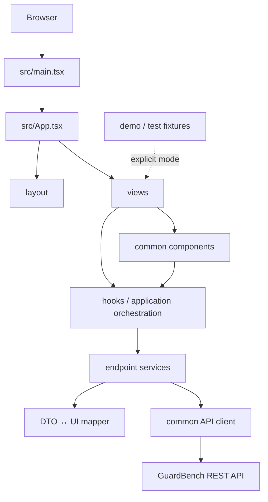
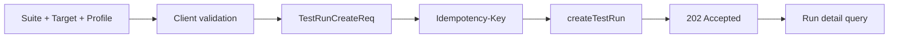
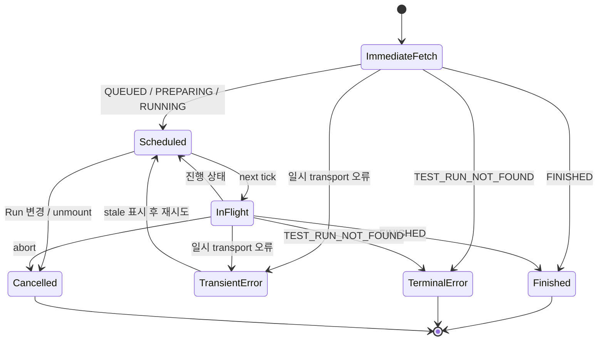

# 프론트엔드 아키텍처

> Status: AS-IS / TO-BE / 미결정
> Owner: Frontend
> Last reviewed: 2026-09-01
> Scope: GitHub Issue #34
> AS-IS baseline: `dev@cc57fbbd17f6c9e2e4b061ca6b930079e367d8f8`
> Canonical API: [`../api/openapi.yaml`](../api/openapi.yaml) (`APPROVED`)
> Product flows: [`../product/screen-spec.md`](../product/screen-spec.md), [`../product/user-flows.md`](../product/user-flows.md)
> API consumption contract: [`../contracts/api-integration.md`](../contracts/api-integration.md)

이 문서는 현재 프론트엔드의 구조와 최신 OpenAPI를 소비하기 위한 목표 책임 경계를 구분한다. 특정 library 도입이나 대규모 폴더 이동을 승인하지 않으며, API schema와 backend의 evaluation·comparability 규칙을 프론트에서 다시 정의하지 않는다.

API 요청·응답의 의미와 우선순위는 OpenAPI를 최우선으로 하고, 프론트엔드 소비 규칙은 [API 연동 계약](../contracts/api-integration.md)을 따른다. 이 문서는 해당 계약을 구현하기 위한 상태 소유권, 의존 방향과 계층 경계만 소유한다.

## 1. 구조 개요



목표 의존 방향은 상위 사용자 표현에서 하위 transport로 한 방향으로 흐른다.

```text
View / Form
  → query·mutation hook 또는 application function
  → endpoint service + mapper
  → common API client
  → OpenAPI
```

하위 계층은 상위 화면을 import하지 않는다. OpenAPI에 없는 값을 mapper나 mock으로 보충해 실제 서버 값처럼 만들지 않는다.

## 2. 현재 구조 (`AS-IS`)

- `main.tsx`가 React `StrictMode` 아래 `App`을 렌더링한다.
- `App`이 shell, 현재 view, 선택 Run ID, mobile menu와 toast를 소유한다.
- router, 전역 server-state 계층과 전역 React error boundary는 없다.
- `views`와 data-aware modal이 API 호출, loading/error, DTO 변환과 사용자 표현을 함께 담당한다.
- `services`가 endpoint 함수와 수동 DTO를 소유하고 `apiClient`가 base URL, fetch와 envelope unwrap을 담당한다.
- `useLiveRunProgress`가 Run 상세 Polling, abort, transient/terminal 오류와 자동 재시도 상한을 처리한다.
- Suite/TestCase, Run 생성·목록·상세·결과·metrics 화면은 API의 data/empty/error/stale 상태를 구분한다.
- `mockData`는 Architecture의 정적 설명 자료에만 남아 있다. API 화면은 실패를 mock 성공으로 대체하지 않는다.

현재 코드는 최신 OpenAPI의 단일 Application Target, Evaluation Profile, Evaluator 결과와 metrics를 사용한다. comparison 응답은 ID 외 case-level 필드가 미확정이므로 별도 선택 구현으로 남긴다.

## 3. 실행과 환경 경계

### 현재 (`AS-IS`)

- Vite가 dev/build/preview를 담당하고 `tsc -b`가 build 전 TypeScript를 검사한다.
- `runtimeConfig`는 `VITE_DATA_MODE`와 `VITE_API_BASE_URL`을 읽는다.
- data mode 기본값은 `api`, base URL 기본값은 `/api/v1`이다.
- Vite proxy 설정이 없어 상대 base URL의 실제 연결은 배포 환경에 의존한다.

### 목표 (`TO-BE`)

- 브라우저 환경 변수에는 secret, provider credential과 내부 Evaluator 설정을 포함하지 않는다.
- API와 demo mode를 명시적으로 구분하고 잘못된 API 설정을 mock으로 대체하지 않는다.
- Application 자연어 응답은 public API와 frontend state에 포함하지 않는다.
- build-time 설정, 배포별 주입과 runtime 변경이 필요한 설정의 경계를 문서화한다.

production mock 허용 여부, 설정 누락 시 fail-fast와 runtime config 전달 방식은 `미결정`이다.

## 4. Navigation과 화면 identity

### 현재 (`AS-IS`)

- 여섯 view를 `App.currentView`로 조건부 렌더링한다.
- 선택 Run ID도 `App` memory에만 저장한다.
- URL이 바뀌지 않아 직접 링크, browser history와 새로고침 복원이 불가능하다.

### 목표 책임 (`TO-BE`)

- 화면 identity와 resource identity를 local modal/form state와 분리한다.
- Run 상세와 Regression 비교 진입에는 실제 Run ID를 보존한다.
- `#5001` 같은 화면 장식 문자열을 API ID나 cache identity로 사용하지 않는다.
- 잘못된 route/ID, resource 404와 정상 빈 collection을 구분한다.
- navigation으로 Run이 바뀌면 이전 Run의 request와 Polling을 정리한다.

router 도입, canonical URL, filter/page query 보존과 form draft 복원은 `미결정`이다.

## 5. 상태 소유권

서버 상태, 파생 표시 상태와 local interaction state를 구분한다.

| 상태 | 서버 source of truth | 목표 소유 단위 | local state와 분리할 항목 |
| --- | --- | --- | --- |
| Suite 목록 | `GET /test-suites` | query + items/page/filter | 선택 card, 생성 modal |
| Suite 상세 | `GET /test-suites/{id}` | Suite ID별 query | 편집 form draft |
| TestCase 목록 | `GET /test-suites/{id}/test-cases` | Suite ID + page/filter | 선택 row, create/edit form |
| TestCase 상세 | `GET /test-cases/{testCaseId}` | TestCase ID별 query | edit form draft |
| Run 목록 | `GET /test-runs` | page/filter/sort별 query | 검색 input draft, 선택 Run |
| Run 상세 | `GET /test-runs/{id}` | Run ID별 query/Polling | tab, 펼침 상태 |
| Run 결과 | `GET /test-runs/{id}/results` | Run ID + page/filter/sort | 선택 result row |
| Evaluator metrics | `GET /test-runs/{id}/evaluator-metrics` | Run ID별 독립 query | chart/table 표현 선택 |
| Comparable Runs | `GET /test-runs/{id}/comparable-runs` | current Run ID + page | 선택 comparison Run |
| Run comparison | `GET /test-runs/{currentRunId}/comparisons/{comparisonRunId}` | 두 Run ID 조합 | changed-only 등 UI filter |

### 5.1 Query identity

query identity는 endpoint 결과를 유일하게 결정하는 입력을 포함한다.

- collection은 resource ID, page, size, sort와 server filter를 포함한다.
- Run 상세·metrics는 Run ID를 포함한다.
- comparison은 current Run ID와 comparison Run ID를 모두 포함한다.
- 서로 다른 filter/page 결과를 같은 state에 합쳐 전체 collection처럼 취급하지 않는다.

구체 cache key 형식과 library는 `미결정`이다. library가 없어도 이 identity 원칙은 유지한다.

### 5.2 Nullable와 파생 상태

- required + nullable field의 누락은 계약 불일치이고 명시적 `null`은 허용된 상태다.
- `qualityGate: null`과 `qualityGate.status: NOT_EVALUATED`를 분리한다.
- verdict가 없는 결과의 assertion/outcome을 FAIL이나 FP/FN으로 추정하지 않는다.
- Result page 일부로 전체 Evaluator metrics나 Quality Gate를 다시 계산하지 않는다.
- 화면용 label, percentage formatting과 badge는 원본 DTO를 바꾸지 않는 파생 상태다.

## 6. API 계층과 mapper

### 계층별 책임

| 계층 | 책임 |
| --- | --- |
| common client | base URL, 공통 header, fetch, success envelope, `204`, transport/HTTP/API 오류 |
| endpoint service | method, path/query/header/body와 API DTO |
| mapper | API DTO를 화면 model로 손실 없이 변환 |
| hook/application | query·mutation lifecycle, Polling, request identity, 취소와 동기화 |
| view | 사용자 action과 loading/empty/error/stale/success 표현 |

### DTO 원칙

- OpenAPI schema와 enum을 source of truth로 사용한다.
- API DTO와 화면 model을 분리한다.
- 단일 Target을 legacy `baseline/candidate` 구조로 변환하지 않는다.
- `evaluationProfile`을 Evaluator provider 설정이나 저장 resource ID로 바꾸지 않는다.
- Application 자연어 응답, provider 원문, stack trace를 DTO에 추가하지 않는다.
- comparison DTO가 확정되기 전 case별 change/classification model을 만들지 않는다.
- unknown public error code도 stage/message와 함께 보존한다.

수동 DTO 유지, OpenAPI type generation, runtime schema validation과 mapper 위치는 `미결정`이다.

## 7. TestRun 생성 mutation



- form draft와 server mutation 상태를 분리한다.
- request body는 `testSuiteId`, 단일 `target`과 inline `evaluationProfile`만 포함한다.
- 하나의 Profile strictness를 선택된 모든 checks에 공통 적용한다.
- 같은 논리적 재전송은 같은 key와 body를 사용하고 다른 body에 key를 재사용하지 않는다.
- `202`를 실행 완료로 처리하지 않는다.
- response의 Run ID와 `Location` header를 보존하고 Run detail identity로 이동한다.
- `TEST_SUITE_EMPTY`는 활성 TestCase 준비 흐름으로 연결한다.
- `IDEMPOTENCY_KEY_CONFLICT`는 같은 key를 다른 body에 사용한 충돌이므로 자동 재전송을 중단한다.
- network/timeout은 접수 여부가 불명일 수 있으므로 명시적 validation/API 거부와 구분한다.

Idempotency-Key의 생성·보존·폐기 구현은 `미결정`이다.

## 8. Polling 구조

Polling은 Run 상세 query의 lifecycle 조율이며 별도 Run 상태를 만들어내지 않는다.



- Run ID가 바뀌면 timer와 in-flight request를 취소한다.
- 요청이 겹치지 않도록 다음 fetch 예약과 현재 request 완료를 조율한다.
- 늦게 도착한 이전 Run 응답은 폐기한다.
- FINISHED에서 중단하고 results와 metrics query를 활성화한다.
- 일시 오류 후 이전 detail을 유지하면 stale로 표시한다.
- `TEST_RUN_NOT_FOUND` 같은 terminal API 오류와 일시 transport 오류를 분리한다.
- results, evaluator-metrics 또는 비교 조회에서 `TEST_RUN_NOT_FINISHED`가 발생하면 terminal 오류나 empty로 확정하지 않고 Run detail을 다시 확인한다.

interval, backoff, jitter, background tab과 최대 지속 시간은 `미결정`이다.

## 9. 결과와 Evaluator 분석 경계

Run이 FINISHED이면 detail과 별도로 results 및 evaluator-metrics를 조회한다.

```text
RunDetail
├─ lifecycle / progress / outcome / Quality Gate
├─ target / evaluationProfile
├─ ResultCollection(page + filters)
└─ EvaluatorMetrics(TP/TN/FP/FN + rates)
```

- detail, result collection과 metrics의 loading/error/stale 상태를 각각 보존한다.
- results가 실패해도 이미 성공한 detail을 지우지 않는다.
- metrics 실패를 Quality Gate 실패나 Run ERROR로 바꾸지 않는다.
- result filter는 저장 결과 목록만 좁히며 metrics를 바꾸지 않는다.
- `evaluationOutcome`의 TP/TN/FP/FN 분류는 서버 결과를 보존하며 verdict가 없으면 추정하지 않는다.
- `APPLICATION_TARGET` 또는 `EVALUATOR` failure stage는 assertion과 다른 축으로 표시한다.
- 원문 Application response는 frontend state, modal과 export에 포함하지 않는다.
- results 또는 evaluator-metrics가 `TEST_RUN_NOT_FINISHED`를 반환하면 detail 상태를 다시 조회하고 진행 흐름으로 복귀한다.

Quality Gate metrics의 구체 field가 확정되면 detail mapper와 표시 model을 별도로 갱신한다.

## 10. Comparable Runs와 comparison 경계

Regression은 현재 Run 자체의 Quality Gate와 독립적인 조회 기능이다.

1. current Run ID로 comparable-runs를 조회한다.
2. backend가 반환한 비교 후보만 선택 가능하게 한다.
3. current/comparison Run ID 조합으로 comparison을 조회한다.
4. Run을 바꾸면 후보, 선택과 comparison state를 함께 무효화한다.
5. 비교 API는 저장 결과만 사용하며 Application/Evaluator를 재호출하지 않는다.
6. `TEST_RUN_NOT_FINISHED`이면 관련 Run detail을 다시 확인한다.
7. `TEST_RUNS_NOT_COMPARABLE`이면 comparison state를 비우고 comparable-runs를 재조회하거나 다른 후보를 선택하게 한다.

comparability 규칙을 프론트에서 복제하거나 같은 Suite라는 이유로 후보를 추가하지 않는다. 현재 comparison response는 ID만 확정됐으므로 case-level result state와 UI mapper는 backend #119의 OpenAPI 확정 후 추가한다.

## 11. Mutation 동기화

| mutation | 성공 후 동기화 | 실패 원칙 |
| --- | --- | --- |
| Suite 생성 | 목록에 server response 반영 또는 관련 query 재조회 | validation을 form에 유지 |
| Suite 수정 | 상세·목록의 관련 data 동기화 | 원래 server data를 성공으로 덮지 않음 |
| TestCase 생성 | 현재 Suite의 collection/page 재동기화 | 임시 item을 실제 ID처럼 유지하지 않음 |
| TestCase 수정 | 상세·목록의 동일 ID 갱신 | 과거 Snapshot 결과를 수정하지 않음 |
| TestCase 삭제 | `204` 후 제거 또는 재조회 | 실패 시 성공 제거를 확정하지 않음 |
| Run 생성 | 반환 Run ID의 detail query로 이동 | 접수 결과 불명과 명시적 거부 구분 |

낙관적 update, invalidate/refetch와 rollback 방식은 endpoint별로 결정한다. 어떤 방식이든 server response 이전에 성공을 확정하지 않는다.

## 12. 오류와 복구 경계

| 경계 | 책임 |
| --- | --- |
| common client | network, abort, invalid response, HTTP/envelope 오류 구조화 |
| endpoint service | endpoint context와 공개 code/field error 보존 |
| mapper | 계약에 맞지 않는 shape를 정상 empty로 바꾸지 않음 |
| hook/application | retry, stale, race, mutation 결과 불명 조율 |
| view | 지속 오류, field error, empty와 재시도 표현 |
| React error boundary | 예상하지 못한 render 오류 격리 |

- request abort를 실패 toast로 표시하지 않는다.
- stale data에는 갱신 실패 상태를 함께 표시한다.
- execution result의 `error.stage`와 HTTP request error를 같은 오류로 처리하지 않는다.
- server가 공개하지 않은 provider 원문과 내부 예외를 노출하지 않는다.
- unknown code는 버리지 않고 안전한 일반 표현과 진단 context를 유지한다.

현재 global error boundary, logging/observability와 인증 오류 정책은 없다. 도구와 사용자 문구는 `미결정`이다.

## 13. Demo, mock과 fixture

- 실제 API mode와 demo mode를 runtime config에서 명시적으로 구분한다.
- API data와 mock item을 같은 collection에 섞지 않는다.
- API 실패·empty를 mock 성공으로 대체하지 않는다.
- 정적 대시보드·아키텍처 자료에는 demo 출처를 표시한다.
- test fixture는 OpenAPI의 required/nullable/error 조합을 따라야 하지만 contract test를 대신하지 않는다.
- legacy Baseline/Candidate fixture는 새 TestRun 목표 model의 fixture로 재사용하지 않는다.

fixture 위치, production demo 허용과 API/mock adapter interface는 `미결정`이다.

## 14. Component 책임

### 현재 (`AS-IS`)

- `App`: shell, view 전환, 선택 Run과 toast
- `layout`: sidebar/topbar와 mobile navigation
- `views`: 화면 composition + request + mapping + 상태 표현
- `common`: 표시 component와 data-aware modal 혼재
- `hooks`: 미연결 Polling orchestration

### 목표 (`TO-BE`)

- view는 화면 composition과 사용자 상태 표현을 소유한다.
- form은 draft/validation/submission을 소유하되 HTTP envelope를 해석하지 않는다.
- common 표시 component는 endpoint, DTO와 mock을 직접 import하지 않는다.
- data-aware modal은 query/mutation identity와 외부 갱신 계약을 명시한다.
- Status component는 lifecycle, outcome, Quality Gate, assertion과 execution status의 의미를 합치지 않는다.
- Snapshot 상세는 public result DTO만 사용하며 Application 원문을 요구하지 않는다.

prop drilling, context와 전역 store 선택은 실제 공유 범위를 확인한 뒤 결정한다.

## 15. 폴더와 의존 규칙

### 현재 구조

```text
src/
├─ components/
│  ├─ layout/
│  ├─ views/
│  └─ common/
├─ config/
├─ contracts/
├─ hooks/
├─ services/
├─ mocks/
├─ types/
├─ App.tsx
└─ main.tsx
```

### 목표 규칙

- common client와 services는 React component를 import하지 않는다.
- common display component는 특정 view/service를 import하지 않는다.
- API DTO와 UI model의 소유 위치를 구분한다.
- transport 계층이 UI 계층을 참조하지 않는다.
- production service가 mock을 implicit fallback으로 import하지 않는다.
- 순환 import를 허용하지 않는다.
- 폴더 이동은 구현 이슈에서 검증 가능한 단위로 수행한다.

feature-based 폴더, query library와 generated API package 도입은 이 문서에서 확정하지 않는다.

## 16. 테스트 전략

### 현재 (`AS-IS`)

- package script는 `dev`, `build`, `lint`, `preview`를 제공하지만 자동화된 `test` script는 없다.
- Playwright dependency와 `test_playwright.cjs`가 있지만 표준 test 실행 계약은 없다.
- 현재 workflow는 `main` 대상 PR/push에서 build를 실행하고 `docs/**` 변경은 제외한다. `dev` 대상 문서 PR에는 CI check가 생성되지 않는다.
- `src/contracts/openapiNullability.contract.ts`는 `tsc -b`에서 OpenAPI의 대표 required + nullable DTO 조합을 compile-time contract로 검증한다.
- 자동화된 unit/component/E2E 기반과 OpenAPI fixture 기반 contract test는 없다.

### 목표 검증 경계

| 수준 | 주요 검증 |
| --- | --- |
| Unit | DTO mapper, nullable 상태, query serialization, error mapping |
| Component | form validation, loading/empty/error/stale, status 구분 |
| Integration | service 연결, mutation 동기화, Polling 취소·race |
| Contract | OpenAPI fixture drift, required/nullable/additionalProperties |
| E2E | Suite 준비 → Run 접수 → Polling → 결과·metrics 검토 |

반드시 포함할 대표 계약 조합은 다음과 같다.

- Profile 전체의 단일 strictness와 복수 checks
- `qualityGate: null`과 `NOT_EVALUATED + metrics: null`
- execution failure와 assertion FAIL 분리
- verdict/assertion/outcome nullable 조합
- result filter empty와 전체 empty 구분
- current Run 변경 시 metrics/comparison state 격리
- Application 원문이 DTO·UI·log에 포함되지 않음

test framework, 실제 backend 사용 범위와 CI required check는 `미결정`이다.

## 17. 구현 순서와 Decision

| 순서 | 구현 범위 | 관련 이슈 |
| --- | --- | --- |
| 1 | 생성 DTO와 Application Target + Evaluation Profile form | #27 |
| 2 | Run detail/results DTO, mapper와 결과 화면 | #28 |
| 3 | Evaluator metrics query와 분석 화면 | #29 |
| 4 | comparable-runs와 comparison | #30 / backend #119 |

별도 Decision 후보:

- router와 URL 상태
- OpenAPI generated type/runtime validation
- query/cache library
- Idempotency-Key 보존
- Polling retry/backoff
- global error boundary와 observability
- explicit demo adapter
- test framework와 CI

## 18. 검증 근거

- [`../api/openapi.yaml`](../api/openapi.yaml)
- [`../contracts/api-integration.md`](../contracts/api-integration.md)
- [`../product/screen-spec.md`](../product/screen-spec.md)
- [`../product/user-flows.md`](../product/user-flows.md)
- `src/main.tsx`, `src/App.tsx`
- `src/components/layout`, `src/components/views`, `src/components/common`
- `src/config`, `src/services`, `src/hooks`, `src/types`, `src/mocks`
- `package.json`, `vite.config.ts`, `tsconfig.app.json`
- GitHub Issues #27, #28, #29, #30, #34

실제 코드 재구성, library 도입, backend E2E와 OpenAPI 변경은 이 Issue 범위에 포함하지 않는다.
