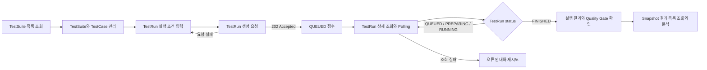
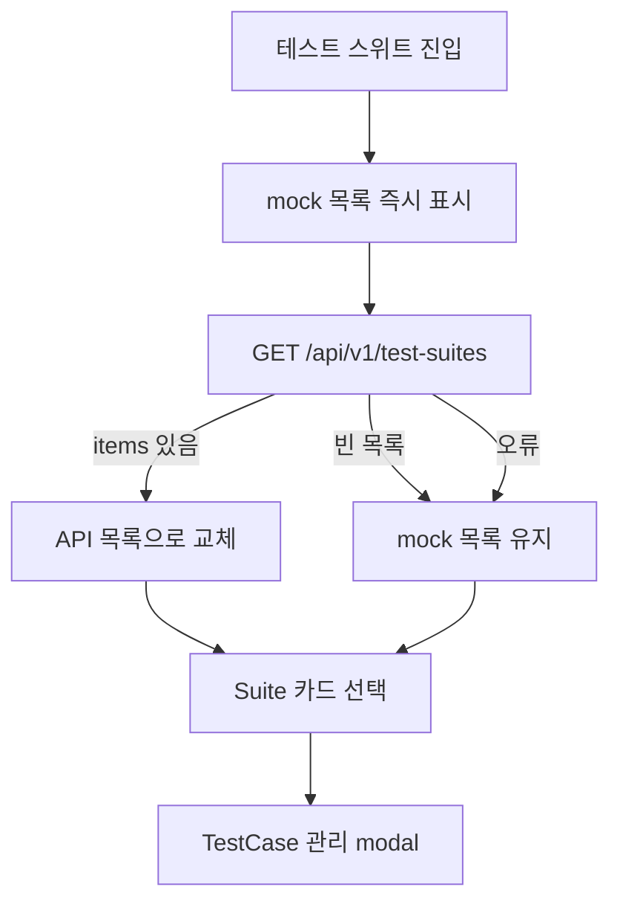
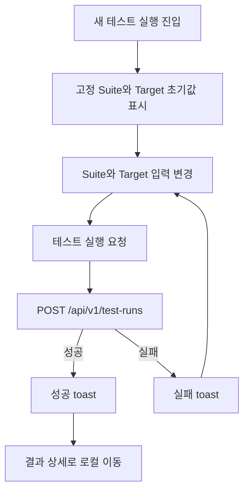
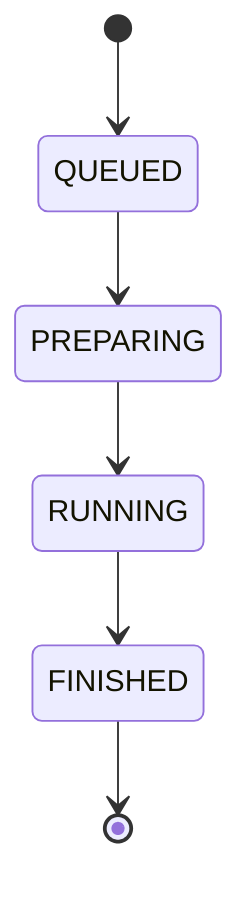

# 프론트엔드 사용자 흐름

> Status: AS-IS / TO-BE / 미결정
> Owner: Frontend
> Last reviewed: 2026-08-30
> Scope: GitHub Issue #11
> Canonical product scope: `guardbench-backend/docs/product/mvp-scope.md` (`APPROVED`)
> Canonical API: `guardbench-backend/docs/api/openapi.yaml` (`APPROVED`)

이 문서는 GuardBench 사용자가 테스트 자산을 관리하고 TestRun을 요청한 뒤 결과를 분석하기까지의 흐름을 연결한다. 현재 코드에서 관찰되는 동작과 승인된 백엔드 계약이 요구하는 목표 동작을 구분하며, 근거가 없는 제품 정책은 확정하지 않는다.

## 1. 읽는 방법

### 상태 표기

| 상태 | 의미 |
| --- | --- |
| `AS-IS` | 현재 프론트엔드 코드에서 실제로 관찰되는 동작이다. 목표 동작이라는 의미는 아니다. |
| `TO-BE` | 승인된 MVP 범위와 OpenAPI에서 직접 도출되는 목표 동작이다. |
| `미결정` | 제품 또는 프론트엔드 정책 결정이 필요하며 구현 기준으로 사용할 수 없다. |

### 흐름 단계의 데이터 출처

- `API`: 현재 코드가 백엔드 endpoint를 호출한다.
- `mock`: `src/mocks/mockData.ts`의 정적 데이터를 사용한다.
- `로컬`: React 메모리 상태만 변경하며 새로고침하면 사라진다.
- `데모`: 사용자에게 동작처럼 보이지만 API 호출이나 영속 변경이 없다.
- `미구현`: 승인된 계약에는 있으나 현재 UI 흐름이 없다.

화면 이름은 [화면 및 기능 명세](screen-spec.md)의 명칭을 따른다. 요청·응답 필드는 이 문서에서 다시 정의하지 않고 승인된 OpenAPI를 참조한다.

## 2. 전체 여정



승인된 MVP 여정은 TestSuite와 TestCase 관리, Baseline numbered version과 Candidate DRAFT를 이용한 TestRun 생성 요청, 비동기 접수 이후의 진행 확인, 완료된 결과와 Snapshot 분석 순서다. 생성 API는 `202 Accepted`와 `QUEUED` TestRun을 반환하며, 프론트엔드는 접수 직후부터 상세 조회로 상태를 확인할 수 있다. Snapshot 결과 목록은 `FINISHED` 이후에 조회한다. 현재 프론트엔드는 이 여정의 일부만 API와 연결되어 있고, TestRun 진행 확인과 결과 분석은 mock 또는 미사용 코드에 의존한다.

| 구간 | 관련 화면 | 현재 상태 | 핵심 차이 |
| --- | --- | --- | --- |
| TestSuite 목록 확인 | 테스트 스위트 | 부분 구현 | API 실패·빈 결과를 mock으로 대체한다. |
| TestSuite 생성·수정 | 테스트 스위트 | 데모·미구현 | 서비스 함수은 있으나 연결된 UI가 없다. |
| TestCase 조회·생성·삭제 | TestCase 관리 modal | 부분 구현 | 수정은 데모이며 삭제·재동기화와 오류 처리가 불완전하다. |
| TestRun 생성 | 새 테스트 실행 | 부분 구현 | 요청과 응답 타입이 승인된 OpenAPI와 일치하지 않는다. |
| 진행 확인 | 실행 이력, 결과 상세 | 미구현 | Polling 훅은 어떤 화면에서도 사용하지 않는다. |
| 결과 요약 | 결과 상세 | mock 중심 | API 응답 계약과 UI mapping이 일치하지 않는다. |
| Snapshot 분석 | Snapshot diff modal | mock | 실제 Snapshot 결과를 표시하지 않는다. |

## 3. TestSuite 및 TestCase 관리

### 사용자 목표

재사용할 정책 테스트 묶음과 개별 기대 동작을 조회하고 관리한다.

### 시작 조건과 진입점

- 사용자가 사이드바에서 `테스트 스위트`를 선택한다.
- 별도 URL routing이 없으므로 직접 링크와 새로고침 복원은 지원하지 않는다. (`AS-IS`)

### 3.1 TestSuite 목록 확인



1. 화면은 `mockSuites`를 먼저 표시한다. (`AS-IS`, mock)
2. `GET /api/v1/test-suites`를 호출하며 제목 옆에 작은 spinner를 표시한다. (`AS-IS`, API)
3. 응답에 항목이 있으면 API 결과를 카드 형식으로 변환한다. (`AS-IS`)
4. 빈 목록이거나 요청에 실패하면 오류 안내 없이 mock 목록을 유지한다. (`AS-IS`)
5. 사용자가 카드를 선택하면 TestCase 관리 modal을 연다. (`AS-IS`, 로컬)

성공 종료 조건은 사용자가 실제 TestSuite 목록을 확인하고 원하는 Suite의 TestCase 관리로 진입하는 것이다. 다만 현재 화면은 API와 mock을 구분하지 않으므로 이 조건이 충족됐는지 사용자가 판단할 수 없다.

`TO-BE`에서는 승인된 목록 API의 빈 응답을 실제 빈 상태로 표시하고, 조회 실패를 mock 데이터로 숨기지 않아야 한다. 구체적인 빈 화면 CTA와 재시도 표현은 UI 가이드에서 결정한다.

### 3.2 TestSuite 생성·수정

| 동작 | 현재 흐름 | 승인된 계약에서 확인되는 목표 |
| --- | --- | --- |
| 생성 | 만들기 버튼은 안내 toast만 표시한다. (`AS-IS`, 데모) | `POST /api/v1/test-suites`로 Suite와 선택적 초기 TestCase를 원자적으로 생성한다. (`TO-BE`) |
| 수정 | 연결된 UI가 없다. (`AS-IS`, 미구현) | `PATCH /api/v1/test-suites/{suiteId}`로 이름과 설명을 부분 수정한다. (`TO-BE`) |
| 삭제 | UI와 endpoint가 없다. (`AS-IS`) | 승인된 OpenAPI에도 TestSuite 삭제 endpoint가 없으므로 MVP 목표로 확정하지 않는다. |

생성·수정 폼의 진입 위치, 취소 시 작성값 보존, 성공 후 이동 위치는 `미결정`이다. 프론트엔드 서비스에 함수가 있다는 사실만으로 사용자 흐름이 구현된 것으로 보지 않는다.

### 3.3 TestCase 조회

1. Suite 카드 선택 시 TestCase 관리 modal을 연다. (`AS-IS`)
2. 화면은 `suite-` 접두사를 제거한 값을 ID로 사용해 `GET /api/v1/test-suites/{suiteId}/test-cases`를 호출한다. (`AS-IS`)
3. 조회 중 제목 옆 spinner를 표시한다. (`AS-IS`)
4. 성공하면 API 항목을 표시한다. 실패하면 선택한 mock Suite의 TestCase를 표시한다. (`AS-IS`)
5. 결과가 비어 있으면 설명이나 CTA 없이 빈 table을 표시한다. (`AS-IS`)

`TO-BE`에서는 실제 빈 결과, TestSuite 미존재, validation 오류와 일시적 네트워크 오류를 구분할 수 있어야 한다. Pagination의 page 기준과 UI 이동 방식은 API 연동 계약 문서에서 정한다.

### 3.4 TestCase 생성

1. 사용자가 modal 안에서 TestCase 추가 영역을 연다. (`AS-IS`)
2. 이름, input, category, expected action, severity를 입력한다. (`AS-IS`)
3. 현재 클라이언트는 이름과 input의 빈 문자열만 검사하며 공백 문자열과 나머지 field 오류는 서버에 맡긴다. (`AS-IS`)
4. `POST /api/v1/test-suites/{suiteId}/test-cases`를 호출한다. (`AS-IS`, API)
5. 성공 응답 대신 임시 ID를 만든 뒤 로컬 목록 끝에 항목을 추가한다. (`AS-IS`, 로컬)
6. 실패하면 일반 toast를 표시하고 입력 화면에 남는다. (`AS-IS`)

성공 종료 조건은 서버가 생성한 TestCase가 서버 ID와 최신 pagination 정보로 목록에 반영되는 것이다. 현재는 서버 응답과 목록을 재동기화하지 않아 이 조건을 완전히 충족하지 않는다.

중복 제출 방지, field별 validation 표시, 생성 성공 후 페이지 위치는 `미결정`이다.

### 3.5 TestCase 수정·삭제

#### 수정

- 편집 아이콘은 편집 폼을 열거나 API를 호출하지 않고 안내 toast만 표시한다. (`AS-IS`, 데모)
- `TO-BE`에서는 `PATCH /api/v1/test-cases/{testCaseId}`로 하나 이상의 허용 field를 원자적으로 수정한다.
- 과거 TestRun의 Snapshot은 현재 TestCase 수정과 무관하게 유지된다. (`TO-BE`, 승인된 계약)

#### 삭제

1. 사용자가 삭제 아이콘을 선택한다. (`AS-IS`)
2. 확인 절차 없이 `DELETE /api/v1/test-cases/{testCaseId}`를 호출한다. (`AS-IS`)
3. 현재 구현은 요청 결과와 무관하게 로컬 목록에서 항목을 제거하고 성공 toast를 표시한다. (`AS-IS`)
4. API는 성공 시 body 없는 `204`를 반환하지만 공통 client는 JSON parsing을 시도할 수 있다. (`AS-IS`, 계약 불일치 가능)
5. `TO-BE`에서 삭제된 TestCase는 현재 조회와 이후 TestRun에서 제외되며 과거 Snapshot과 결과는 유지된다.

삭제 확인 방식과 실패 후 UI 복원 방식은 `미결정`이다. 실패를 성공으로 표시하는 현재 동작은 별도 구현 이슈 대상이다.

### 관리 흐름의 오류·취소 분기

| 상황 | AS-IS | TO-BE 또는 미결정 |
| --- | --- | --- |
| 목록 조회 실패 | mock으로 조용히 대체 | 오류와 재시도 제공 필요 (`TO-BE`) |
| 빈 Suite/TestCase 목록 | mock 또는 빈 table | 실제 빈 상태 표시 필요 (`TO-BE`) |
| 잘못된 ID / 404 | 일반 오류 또는 mock fallback | 리소스 미존재를 구분해야 함 (`TO-BE`) |
| 생성 validation 실패 | 일반 toast | field 오류 mapping은 API 연동/UI 가이드에서 결정 (`미결정`) |
| modal 취소 | 닫으면 로컬 입력 상태 소멸 가능 | 작성값 보존 정책 (`미결정`) |
| 삭제 실패 | 성공처럼 로컬 제거 | 실패 안내와 서버 재동기화 필요 (`TO-BE`) |

## 4. TestRun 생성

### 사용자 목표

하나의 TestSuite Snapshot을 동일 Guardrail의 Baseline numbered version과 Candidate DRAFT에 실행하도록 요청한다.

### 시작 조건과 진입점

- 사이드바 또는 다른 화면의 `새 테스트 실행` 동작으로 진입한다.
- 인증이나 권한 선행 조건은 현재 MVP 계약에 정의되어 있지 않다.

### 현재 흐름 (`AS-IS`)



1. 화면은 API 조회 없이 세 개의 고정 Suite option과 Target 초기값을 표시한다.
2. 사용자가 Suite, Baseline ID/version, Candidate ID/version을 입력한다.
3. 버튼을 선택하면 제출 중 버튼을 비활성화하고 문구를 변경한다.
4. 프론트엔드 전용 payload로 `POST /api/v1/test-runs`를 호출한다.
5. 성공하면 응답의 `runId`를 사용해 toast를 표시하고 결과 상세로 이동한다.
6. 실패하면 오류 message를 toast로 표시하고 같은 화면에 남는다.

현재 요청·응답 형식은 승인된 OpenAPI와 일치하지 않으므로 API를 호출한다는 사실만으로 성공 가능한 흐름으로 간주하지 않는다.

### 승인된 목표 흐름 (`TO-BE`)

1. 사용자가 실제 TestSuite 목록에서 실행 대상을 선택한다.
2. 같은 Guardrail ID에 대해 Baseline numbered version과 Candidate `DRAFT`를 지정한다.
3. 프론트엔드는 필수값과 동일 Guardrail ID 조건을 검증한다.
4. 각 논리적 생성 시도에 `Idempotency-Key`를 부여해 승인된 형식으로 요청한다.
5. 서버는 Candidate DRAFT를 불변 numbered version으로 materialize하고 활성 TestCaseSnapshot을 고정한 뒤 비동기 TestRun을 접수한다.
6. 프론트엔드는 생성 응답의 TestRun ID와 상태를 보존하고 진행 상태를 확인할 화면으로 이동한다.

서버가 DRAFT materialization 또는 Snapshot 고정에 실패했을 때 생성 요청 단계에서 실패하는지, 접수 후 `FINISHED`와 오류 결과로 귀결되는지는 OpenAPI와 백엔드 도메인 계약에 따라 처리하고 프론트엔드에서 추측하지 않는다.

### 중복·오류·취소 분기

| 상황 | 처리 상태 |
| --- | --- |
| 연속 클릭 | 버튼 비활성화로 같은 화면 인스턴스의 연속 클릭은 제한한다. (`AS-IS`) |
| 네트워크 timeout 후 결과 불명 | 멱등 key와 재조회 정책이 없다. (`AS-IS`, 미결정) |
| 같은 논리 요청 재시도 | `Idempotency-Key`를 사용해야 한다. key 생성·보존 수명은 API 연동 문서에서 결정한다. (`TO-BE`) |
| validation 오류 | 현재 일반 toast만 표시한다. field mapping은 미결정이다. |
| 서로 다른 Guardrail ID | 현재 허용하지만 승인된 계약은 허용하지 않는다. |
| 사용자가 화면을 떠남 | 확인이나 draft 보존 없이 로컬 입력이 사라진다. (`AS-IS`) |

생성 성공 후 기본 이동 대상을 실행 이력으로 할지 결과 상세로 할지는 `미결정`이다. 어느 쪽이든 생성된 ID를 잃지 않고 진행 확인으로 이어져야 한다.

## 5. 실행 진행 상태 확인

### 사용자 목표

접수된 TestRun이 어느 단계인지 확인하고, 실행이 끝나면 결과 분석으로 이동한다.

### 승인된 상태 흐름 (`TO-BE`)



- TestRun의 실행 상태는 `QUEUED`, `PREPARING`, `RUNNING`, `FINISHED`다.
- `COMPLETED`, `ERROR`, `INCOMPLETE`는 `FINISHED` 이후에 전이하는 상태가 아니라, 완료된 TestRun의 별도 `executionOutcome` 값이다.
- Quality Gate는 실행 결과와 별도 축이며 `PASS`, `FAIL`, `NOT_EVALUATED`다.
- 실행 중 `qualityGate = null`은 아직 평가 전이라는 뜻이고, 완료 후 `qualityGate.status = NOT_EVALUATED`는 평가할 수 없다는 뜻이다.
- 오류를 별도 TestRun 상태 `FAILED`로 만들지 않는다.
- 처리 진행률은 완료된 TestCase 수와 percent를 기준으로 한다. 실패와 timeout도 더 재시도하지 않는 터미널 결과이면 처리 완료 수에 포함된다.

| 완료 시 별도 결과 축 | 값 | 의미 |
| --- | --- | --- |
| `executionOutcome` | `COMPLETED`, `ERROR`, `INCOMPLETE` | 실행 처리의 완료 결과이며 TestRun status가 아니다. |
| `qualityGate.status` | `PASS`, `FAIL`, `NOT_EVALUATED` | 정책 Gate 판정이며 실행 결과와 별도로 해석한다. |

### 현재 진입점과 동작 (`AS-IS`)

- 실행 생성 성공 시 결과 상세로 이동한다.
- 실행 이력 화면은 mount 시 한 번 목록 API를 호출하고 이후 자동 갱신하지 않는다.
- 결과 상세는 선택한 Run의 results endpoint를 한 번 호출한다.
- `useLiveRunProgress`는 2초 간격 조회를 의도하지만 어떤 화면에서도 사용하지 않는다.
- 훅은 승인된 `status` 대신 `executionStatus`와 존재하지 않는 `FAILED` 상태를 기대한다.
- 새로고침하면 현재 화면과 선택 Run ID를 복원하지 못한다.

따라서 현재 UI에는 실제 Polling 기반 진행 확인 흐름이 없다.

### 목표 Polling 흐름 (`TO-BE`)

1. 생성 응답 또는 실행 이력 선택으로 TestRun ID를 확보한다.
2. `GET /api/v1/test-runs/{runId}`를 즉시 한 번 호출한다.
3. 상태가 `QUEUED`, `PREPARING`, `RUNNING`이면 진행률과 마지막 갱신 시각을 표시하고 정해진 간격 후 다시 조회한다.
4. 상태가 `FINISHED`이면 Polling을 종료한다.
5. `executionOutcome`과 Quality Gate를 표시하고 Snapshot 결과 조회를 활성화한다.
6. 화면 이탈, 다른 Run 선택 또는 component unmount 시 Polling을 중단한다.

Polling 간격, 최대 지속 시간, background tab 처리, 수동 재시도와 일시적 오류의 허용 횟수는 `미결정`이다. 이 값은 API 연동 계약 문서에서 확정해야 한다.

### 조회 오류와 상태 복원

| 상황 | 현재 상태 | 필요한 후속 결정 또는 동작 |
| --- | --- | --- |
| 일시적 네트워크 오류 | mock fallback 또는 갱신 중단 | 자동 재시도와 사용자 안내 정책 (`미결정`) |
| 404 | 별도 처리 없음 | 잘못된 ID 또는 삭제된 리소스 안내 (`TO-BE`) |
| 장시간 상태 변화 없음 | timeout 없음 | 최대 대기 및 수동 새로고침 정책 (`미결정`) |
| 새로고침·직접 URL | 화면과 Run ID 소실 | URL routing과 상태 복원 필요 (`미결정`) |
| FINISHED | 실제 Polling 종료 연결 없음 | Polling 종료 후 결과 조회 (`TO-BE`) |

## 6. 실행 결과 및 Snapshot 분석

### 사용자 목표

TestRun의 실행 신뢰도와 Quality Gate를 확인하고, TestCaseSnapshot별 Baseline/Candidate 결과와 변화 원인을 조사한다.

### 시작 조건과 진입점

- 실행 이력의 행을 선택한다.
- TestRun 생성 성공 후 결과 상세로 이동한다.
- 승인된 결과 collection은 TestRun이 `FINISHED`일 때 안정적으로 조회할 수 있다.

### 현재 결과 상세 흐름 (`AS-IS`)

```mermaid
flowchart TD
    A[결과 상세 진입] --> B[GET /api/v1/test-runs/{id}/results]
    B --> C[응답을 프론트엔드 전용 구조로 기대]
    C --> D[mock Snapshot table 표시]
    B -->|오류 또는 409| D
    D --> E[Snapshot 행 선택]
    E --> F[mock diff modal]
    D --> G[리포트]
    G --> H[안내 toast만 표시]
    D --> I[다시 실행]
    I --> J[입력 복사 없이 새 실행 화면]
```

1. 선택 ID에서 `#`을 제거해 results endpoint를 호출한다.
2. 서비스는 승인된 paginated result가 아니라 `{ run, executionDetails }` 구조를 기대한다.
3. API 성공 여부와 관계없이 Snapshot table과 diff는 mock 데이터를 사용한다.
4. 일부 Target 및 metric 값도 고정 문자열 또는 mock에서 가져온다.
5. Snapshot 행을 선택하면 mock diff modal을 연다.
6. 리포트는 파일을 만들지 않고 안내 toast만 표시한다.
7. 다시 실행은 기존 조건을 복사하지 않고 새 실행 화면으로 이동한다.

현재 화면은 실제 결과 분석이 아니라 결과 형태를 보여주는 데모로 해석해야 한다.

### 승인된 목표 흐름 (`TO-BE`)

1. TestRun 상세에서 `FINISHED`, execution outcome, Target, Quality Gate와 metrics를 확인한다.
2. Quality Gate가 `NOT_EVALUATED`이면 metrics가 없다는 점과 평가 불가 사유를 실행 결과와 함께 구분해 표시한다.
3. `GET /api/v1/test-runs/{runId}/results`의 paginated collection을 조회한다.
4. TestCaseSnapshot별 Expected, Baseline/Candidate 실제 결과, assertion, comparability와 change classification을 표시한다.
5. 특정 Snapshot을 선택하면 동일한 서버 결과를 기반으로 상세 분석을 표시한다.
6. Pagination 및 승인된 filter를 적용하더라도 전체 TestRun의 고정 Snapshot 수와 현재 결과 범위를 혼동하지 않는다.

### 정상·오류·평가 불가 해석

| 조건 | 사용자에게 구분할 내용 |
| --- | --- |
| `COMPLETED` + Gate `PASS` | 실행이 완료되었고 승인된 Gate 기준을 통과했다. |
| `COMPLETED` + Gate `FAIL` | 실행은 정상 완료됐지만 정책 회귀 기준을 통과하지 못했다. |
| `ERROR` 또는 `INCOMPLETE` | 정책 판정 실패와 실행 인프라·처리 문제를 혼동하지 않는다. |
| Gate `NOT_EVALUATED` | 평가 불가이며 PASS나 FAIL로 표현하지 않는다. metrics는 제공되지 않는다. |
| Snapshot Target `FAILED`/`TIMED_OUT`/`NOT_STARTED` | 해당 Target의 실행 문제를 Expected assertion 실패와 분리한다. |
| 비교 불가 | change type을 억지로 분류하지 않고 비교 불가로 표시한다. |

### 빈 결과와 부분 결과

- 승인된 계약에서 filter 없는 FINISHED 결과의 전체 개수는 TestRun의 고정 TestCase 수와 같다. (`TO-BE`)
- 진행 중 results 조회의 HTTP 처리와 UI 이동 방식은 OpenAPI 응답 정의를 기준으로 API 연동 문서에서 구체화한다.
- FINISHED인데 결과가 비어 있거나 일부만 보이면 정상 빈 상태로 단정하지 않고 계약 위반 또는 pagination/filter 상태를 확인해야 한다.
- 현재 mock이 없을 때만 표시되는 빈 문구는 실제 API 빈 결과 정책이 아니다. (`AS-IS`)

Snapshot 상세의 URL 직접 진입, 이전·다음 탐색, 결과 다운로드 형식과 다시 실행 시 입력 복사 범위는 `미결정`이다.

## 7. 공통 예외 흐름

| 상황 | AS-IS | 목표 또는 후속 결정 |
| --- | --- | --- |
| 로딩 | 화면 제목 근처 작은 spinner 또는 제출 버튼 상태 | 기존 콘텐츠 유지 여부와 skeleton 사용은 UI 가이드에서 결정 |
| 빈 결과 | mock 유지 또는 빈 table | 실제 빈 상태와 다음 행동을 제공 (`TO-BE`) |
| API 오류 | toast 또는 조용한 mock fallback | 오류를 숨기지 않고 재시도 경로 제공 (`TO-BE`) |
| validation 오류 | 일반 message toast | API field error mapping 방식 (`미결정`) |
| 네트워크 단절 | 일반 오류와 구분하지 않음 | 연결 복구, 자동·수동 재시도 정책 (`미결정`) |
| 잘못된 식별자 | 전용 화면 없음 | 404와 입력 오류를 구분 (`TO-BE`) |
| 취소 | modal 닫기 또는 화면 이동 | 미저장 변경 확인과 보존 정책 (`미결정`) |
| mock fallback | 사용자에게 표시하지 않음 | 유지 여부를 별도 Decision 이슈에서 결정 |

공통 오류 처리는 백엔드 envelope의 message만 표시하는 현재 방식에 제한되지 않는다. 오류 code와 validation detail 보존, body 없는 `204`, timeout과 request 취소는 API 연동 계약에서 다룬다.

## 8. 화면과 API 추적표

| 사용자 목표 | 화면 | API | AS-IS |
| --- | --- | --- | --- |
| Suite 목록 확인 | 테스트 스위트 | `GET /api/v1/test-suites` | 부분 연동 |
| Suite 생성 | 테스트 스위트 | `POST /api/v1/test-suites` | UI 데모, 서비스만 존재 |
| Suite 수정 | 테스트 스위트 | `PATCH /api/v1/test-suites/{suiteId}` | UI 미구현, 서비스만 존재 |
| TestCase 목록 확인 | TestCase 관리 modal | `GET /api/v1/test-suites/{suiteId}/test-cases` | 부분 연동 |
| TestCase 생성 | TestCase 관리 modal | `POST /api/v1/test-suites/{suiteId}/test-cases` | 부분 연동 |
| TestCase 수정 | TestCase 관리 modal | `PATCH /api/v1/test-cases/{testCaseId}` | UI 데모, 서비스만 존재 |
| TestCase 삭제 | TestCase 관리 modal | `DELETE /api/v1/test-cases/{testCaseId}` | 부분 연동 |
| TestRun 생성 | 새 테스트 실행 | `POST /api/v1/test-runs` | 계약 불일치 |
| 실행 이력 확인 | 실행 이력 | `GET /api/v1/test-runs` | mapping 없이 부분 연동 |
| 진행 상태 확인 | 결과 상세 또는 실행 이력 | `GET /api/v1/test-runs/{runId}` | UI 연결 없음 |
| Snapshot 결과 확인 | 결과 상세 | `GET /api/v1/test-runs/{runId}/results` | mock 중심, 계약 불일치 |

## 9. 미결정 사항

- TestSuite/TestCase 생성·수정 UI의 진입 위치와 저장 후 이동
- 실제 API가 빈 목록을 반환했을 때의 CTA
- TestRun 생성 성공 후 기본 이동 화면
- `Idempotency-Key` 생성 단위와 보존 수명
- Polling 간격, 최대 시간, backoff, background tab과 수동 재시도
- 새로고침과 직접 URL 진입 시 Run 상태 복원 방식
- 실패한 TestRun의 재실행과 입력 복사 범위
- Snapshot 상세 탐색과 결과 내보내기 형식
- API 실패 시 mock fallback 유지 여부와 사용자 표시
- 인증·권한 오류가 도입될 경우의 사용자 흐름

## 10. 후속 구현·Decision 이슈 후보

- TestSuite 생성·수정과 TestCase 수정 UI 구현
- TestCase 생성·삭제 후 서버 상태 및 pagination 재동기화
- TestRun 생성 요청·응답과 `Idempotency-Key`를 OpenAPI에 정렬
- TestRun 목록 DTO mapping과 Suite 이름 표시 전략 결정
- 승인된 상태 모델 기반 Polling 연결
- 결과 상세 및 Snapshot pagination mapping 구현
- API 오류·빈 결과와 mock fallback 정책 결정
- URL routing과 TestRun 직접 링크·상태 복원 도입 결정
- 결과 내보내기 및 재실행 사용자 흐름 결정

이 후보들은 문서화 범위를 확장해 구현하지 않는다. 우선순위와 승인된 동작을 별도 이슈에서 정한다.

## 11. 검증 근거

다음 자료를 대조했다.

- `docs/product/screen-spec.md`
- `src/App.tsx`
- `src/components/views/SuitesView.tsx`
- `src/components/common/SuiteDetailModal.tsx`
- `src/components/views/NewRunView.tsx`
- `src/components/views/RunsView.tsx`
- `src/components/views/ResultDetailView.tsx`
- `src/components/common/SnapshotDiffModal.tsx`
- `src/services/`
- `src/hooks/useLiveRunProgress.ts`
- `src/mocks/mockData.ts`
- `guardbench-backend/docs/product/mvp-scope.md`
- `guardbench-backend/docs/api/openapi.yaml`

실제 backend를 실행한 end-to-end 검증과 제품 정책 확정은 이 Issue 범위에 포함하지 않았다.
